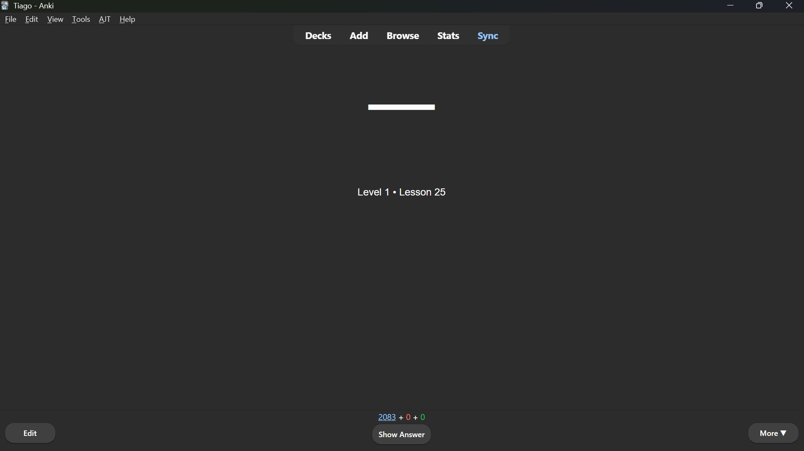
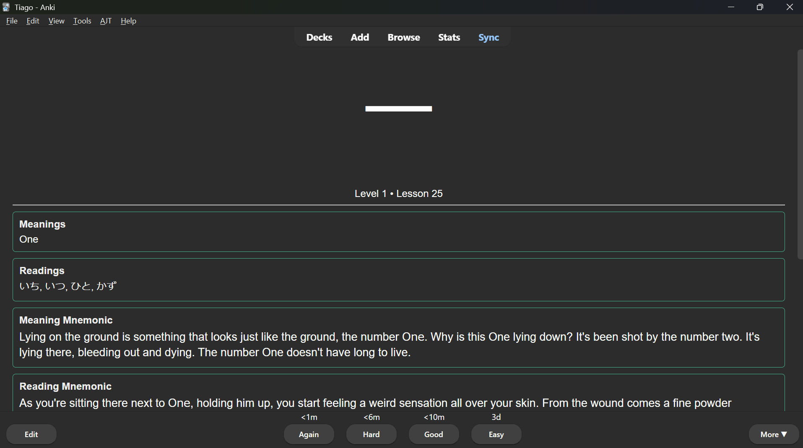
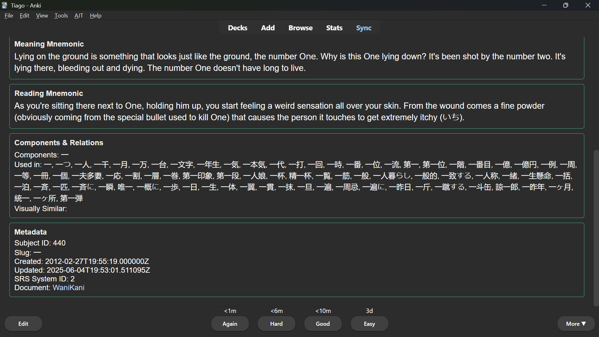

# WaniKani to Anki Deck Generator

A Python script that automatically fetches your WaniKani data and generates a comprehensive Anki deck for studying kanji with detailed information including meanings, readings, mnemonics, and relationships.

## Features

- 🔄 **Automatic Data Sync**: Fetches all your WaniKani subjects (radicals, kanji, vocabulary) via the official API
- 🎴 **Custom Anki Cards**: Beautiful, interactive cards with collapsible sections
- 📚 **Complete Information**: Includes meanings, readings, mnemonics, hints, and component relationships
- ⏱️ **Rate Limit Aware**: Respects WaniKani API rate limits with built-in delays
- 🔍 **Interactive Elements**: Clickable sections to show/hide additional information
- 🎨 **Clean Styling**: Optimized card layout for effective studying

## Card Preview

### Front Side


### Back Side



## Requirements

- Python 3.7+
- WaniKani API v2 token
- Anki installed on your device

## Installation

1. Clone this repository:
```bash
git clone https://github.com/yourusername/japanese-kanji-anki-deck.git
cd japanese-kanji-anki-deck
```

2. Install required dependencies:
```bash
pip install requests genanki
```

3. Get your WaniKani API token:
   - Go to your [WaniKani API Settings](https://www.wanikani.com/settings/personal_access_tokens)
   - Create a new token with "Full Access" permissions

## Usage

### Quick Start

1. **Update the API key** in `showtime_with_vocab.py`:
```python
WANIKANI_API_KEY = "your_actual_api_token_here"
```

2. **Run the main script**:
```bash
python showtime_with_vocab.py
```

3. **Import into Anki**:
   - Open Anki
   - File → Import
   - Select the generated `.apkg` file
   - The deck will appear as "WaniKani Kanji"

### Scripts Overview

- **`showtime_with_vocab.py`** - Main script that fetches WaniKani data and creates the complete Anki deck
- **`gen_cm_pretty.py`** - Template generator showing the card structure and styling

## Configuration

### API Rate Limits
The script includes a 60-second delay between requests to respect WaniKani's API limits:
```python
REQUEST_DELAY = 60  # seconds between API calls
```

### Customization
You can modify the following in the scripts:
- Card styling (CSS in the model definition)
- Field selection and formatting
- Deck name and IDs
- Output file naming

## Card Structure

Each card includes:

**Front:**
- Large kanji character
- Level and lesson position

**Back:**
- Meanings (primary and auxiliary)
- Readings (onyomi, kunyomi, nanori)
- Meaning and reading mnemonics
- Component relationships (collapsible)
- Metadata (collapsible)

## File Structure

```
japanese-kanji-anki-deck/
├── showtime_with_vocab.py    # Main script
├── gen_cm_pretty.py          # Template example
├── images/                   # Screenshots for documentation
│   ├── front.png
│   ├── back1.png
│   └── back2.png
├── README.md                 # This file
└── .gitignore
```

## Output

The script generates an `.apkg` file with timestamp:
```
wanikani_kanji_detailed_YYYYMMDD.apkg
```

## Troubleshooting

### Common Issues

1. **API Token Error**: Make sure your token is correct and has "Full Access"
2. **Import Issues**: Ensure you're using a recent version of Anki
3. **Missing Data**: Some fields may be empty if not available in WaniKani

### Rate Limiting
- WaniKani allows ~60 requests per minute
- The script automatically handles rate limiting
- Large collections may take several minutes to process

## Disclaimer

This project is not affiliated with WaniKani or Anki. Please respect WaniKani's API terms of service and consider supporting them if you find their service valuable.

## Contributing

Feel free to submit issues and pull requests for improvements!

## License

MIT License - see LICENSE file for details.

---

**Happy Studying!** 🎌
